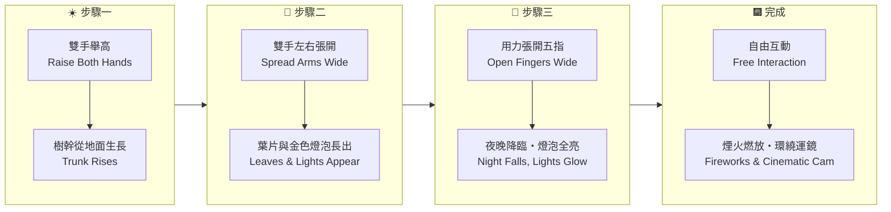
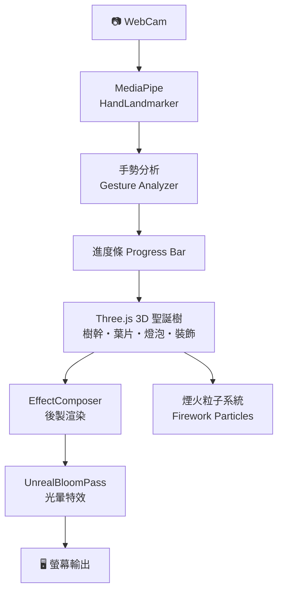

# 🎄 魔法聖誕樹 — Xmas Mission

> **舉起雙手，用動作召喚一棵閃亮的 3D 聖誕樹！**  
> Raise your hands and summon a glowing 3D Christmas tree through gesture magic!


---

## 🎄 介紹 / About

《魔法聖誕樹》是為**永順國小 2025 聖誕節**特別打造的互動裝置體驗頁。  
學生只需站在攝影機前，依照四個步驟做出手勢，就能一步步召喚出一棵帶有燈光、裝飾與煙火的 3D 聖誕樹！

*A festive interactive experience built for Yongshun Elementary School Christmas 2025. Students stand in front of the camera and use hand gestures to grow a full 3D Christmas tree — step by step, from trunk to fireworks.*

---

## ✨ 特色 / Key Features

- 🤚 **AI 手勢偵測** — Google MediaPipe HandLandmarker，即時辨識雙手位置與手指張開程度
- 🌲 **Three.js 3D 聖誕樹** — 5000 顆葉片粒子 + 600 顆裝飾球 + 2500 顆金色燈泡，全部 3D 渲染
- ✨ **Bloom 光暈特效** — UnrealBloomPass 後製，夜晚亮燈後燦爛閃耀
- 🎆 **煙火系統** — 最終階段自動噴發彩色粒子煙火
- 🎥 **電影運鏡** — 完成後攝影機自動環繞＋緩慢推進，沉浸感拉滿
- 🌙 **晝夜切換** — 第三步驟觸發夜晚模式，四盞舞台聚光燈亮起

*AI hand tracking, 5000-particle 3D tree, Bloom post-processing, particle fireworks, cinematic camera, day/night mode.*

---

## 🕹️ 四步驟玩法 / Four-Step Gameplay



| 步驟 / Step | 手勢 / Gesture | 效果 / Effect |
|:---:|:---|:---|
| ① | 雙手舉高（手腕 y < 0.4） | 樹幹粒子從下往上生長 |
| ② | 雙手左右分開（x 差距 > 0.4） | 枝葉・金色燈泡・裝飾球長出 |
| ③ | 張開五指（指尖距手腕均值 > 2.5x） | 夜晚模式・Bloom 光暈・燈泡閃爍 |
| ④ | 自動進入 | 煙火自動噴發・攝影機環繞 |

---

## 🛠️ 技術架構 / Tech Stack



- **Three.js r160** — 3D 場景、粒子系統、Instanced Mesh
- **MediaPipe Tasks Vision** — 手部 21 個關鍵點即時偵測
- **EffectComposer + UnrealBloomPass** — 發光後製效果
- **ES Module** — 原生 import，無需打包工具

---

## 📁 專案結構 / File Structure

```
xmasmission/
└── index.html    # 完整體驗（Three.js + MediaPipe + Bloom 全部內嵌）
```

---

## 🎓 適用場景 / Use Cases

- 🎄 **學校聖誕節活動** — 全班輪流上台做手勢，一起點亮聖誕樹
- 🏫 **STEAM 科技展示** — AI 手勢辨識的最佳展示案例
- 🖥️ **電子白板投影** — 教師機開啟、全班觀看互動，視覺震撼強烈

*Perfect for school Christmas ceremonies, STEAM demonstrations, and interactive whiteboard projections.*

---

## 🔗 連結 / Links

- 🌐 **線上體驗** — [linyubert.github.io/xmasmission](https://linyubert.github.io/xmasmission/)
- 💬 **Threads** — [@lycbert](https://www.threads.com/@lycbert)
- 📺 **YouTube** — [@datoemusic](https://www.youtube.com/@datoemusic)

---

*Made with 🎄 by Dato — 獻給永順國小 2025 全體師生。*  
*A gift for all teachers and students of Yongshun Elementary School, Christmas 2025.*
